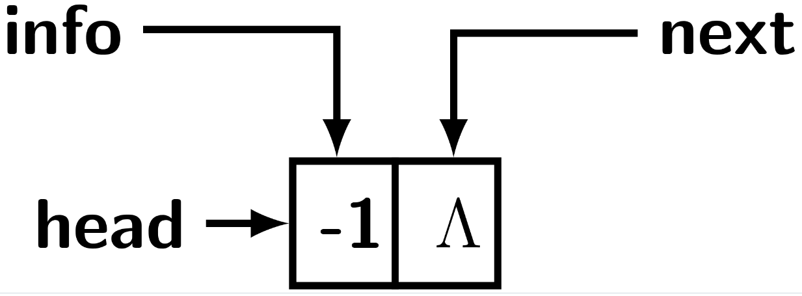

# Linked List

Linked list consists of finite number of objects where each object is represented by a node. The object may be as simple as an integer,
float or character or as complex as a student record with multiple fields like roll, name, age, grades. There is an explicit sequencing 
of objects represented by a linked list. Each node of a linked list has at least two fields: info and
next as in the figure below. 

 
 
The <b>info</b> field stores the object, while <b>next</b> is a pointer to the node that represents the successor object. We can 
access the objects of linked list only from the beginning of the list. It essentially means we have a pointer only to head or the first
node. To access a node in the middle of a linked list then we must navigate the list following the next pointer starting from the 
beginning or the first node. In other words, a linked list allows ordered access to the objects sequentially starting at the first
object. We may not know eactly how many objects are stored in a linked list. It means, we need to have a way of detecting the last 
object or node in a linked list. Most programming language provisions for definine a field as <b>None</b> or a <b>NULL</b>. If a
pointer field is assigne <b>None</b> in Python then it cannot lead to a valid node. Therefore, the end of a linked list is reached
when a node's next field is <b>None</b>.

 
