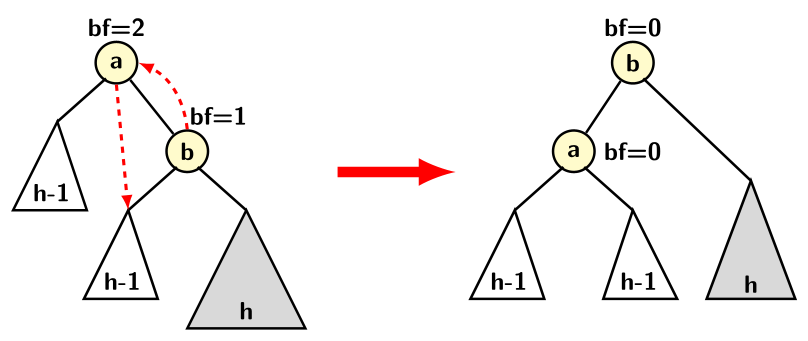
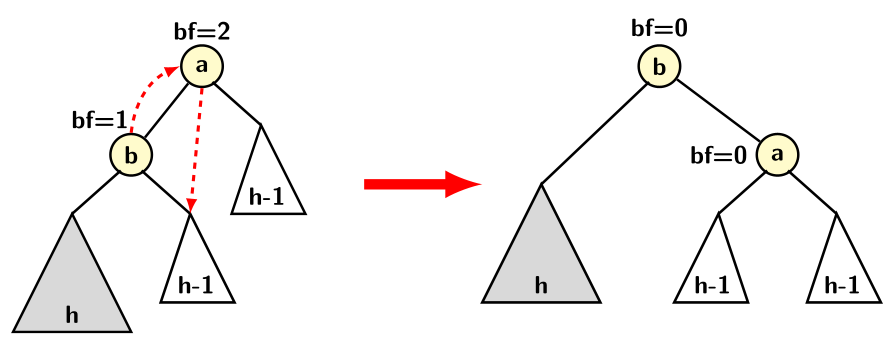
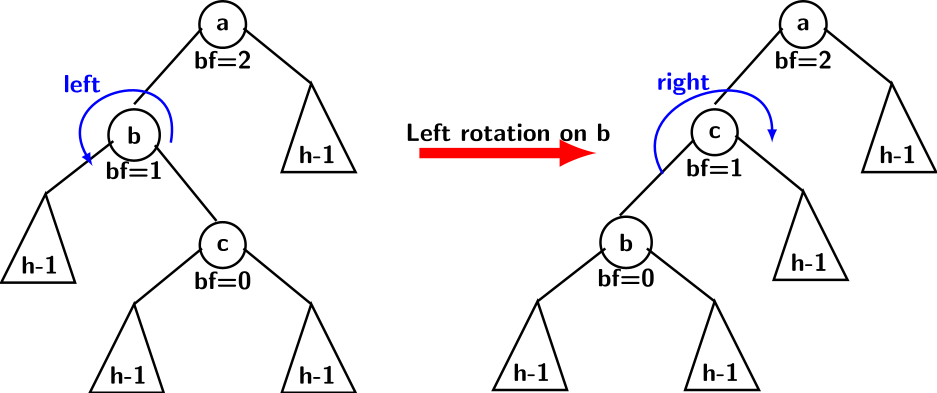
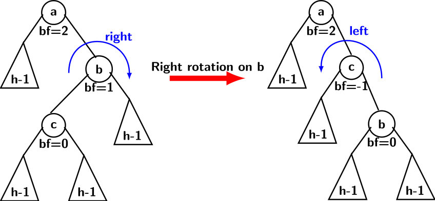
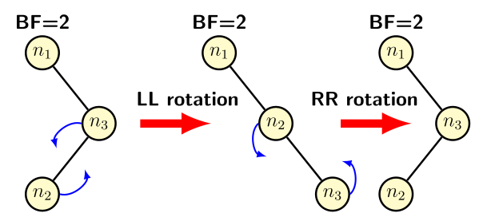



## AVL Tree Animation.

The Animation folder contains three files for animating AVL tree operations. Before dealing with implementation, let us understand the data structure in sufficient detail. It will facilitate our i[...]
- Single left rotation (LR)
- Single right rotation (RR)
- Double rotation

A Double Rotation is a mix of two single rotation types. The combination could be LR, RR, LL, or RL. Sometimes a right rotation is also called a clockwise rotation, while a left rotation is an anticlockwise rotation.

 | Config I | Config II|
  |:----------:|:----------:|
 |  |  |

 

Before going further, we define the balance factor (bf) of a node in a binary search tree (BST):
- It is the difference between the heights of a node's left and right subtrees.

The picture above shows two configurations, one of which is a mirror image of the other. We refer to the left half of the image as Config I, and the right half as Config II.  We fix our explanation with respect to Config I.
- Pushes $a$ down along with its left subtree, 
- Pushes $b$ up to $a$'s previous position along with its right subtree,
- Node $a$ retains its right subtree and adopts the left subtree of $b$ as its new right subtree.

Since $b$ loses its previous left child to adopt $a$ as its new left child, the height of the left subtree of $b$ becomes $h$. The previous left child of $b$ is orphaned, and $a$ should adopt it as its right child.

The picture above shows the following:
- The value of $a$ is smaller than $b$, so $a$ with its left subtree contains values less than $b$,
- The each value in the left subtree of $b$ is greater than the value of $a$,
- The height of the left subtree of $b$ is increased to $h$,
- The height of the right subtree of $b$ remains unchanged at $h$
  
Thus, $bf(b) = 0$, in other words, the single left rotation restores balance properties at $a$ and $b$. Unfortunately, the example does not really expose the whole picture. It need not be the case; the balance factor could be positive or negative.

In both Config I, we need just one rotation involving three nodes: $a$, $b$, and the root of $ b$'s right subtree. The tri-node structure for Config I is referred to as a Zig-Zig pattern, while that for Config II is referred to as a Zag-Zag pattern.

The Config I in the figure below represents a tri-node structure $a-b-c$, which requires double rotation on a Zig-Zag configuration.  Config II in the figure represents a Zag-Zig pattern for the tri-node structure.

 | Config I | Config II|
  |:----------:|:----------:|
 |  |  |

A left rotation on $b$ in Config I turns the tri-node into a Zig-Zig configuration. Now, a single right rotation can fix the balance factors as explained by Config II of the previous figure. Similarly, a right rotation on $b$ in Config II turns it into a Zag-Zag configuration, followed by a single left rotation.

Why is double rotation required at all? The figure below provides an explanation. 

 | Configuration |
  |:----------:|
 |  | 
