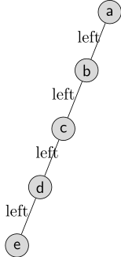
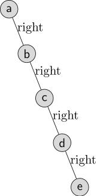
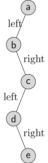
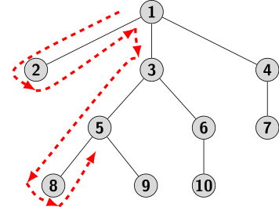



## Binary Tree Animation

A binary tree is the simplest non-linear data structure. Each tree node has two pointers, rather than one, as in a linked list. The two pointers are separately identified as the left and right children. 

We borrow terminology from a family tree to describe relationships between the nodes in a tree. One node is designated as the root of the tree. To explore a binary tree, we always start from a specially designated node called the root. The remaining nodes are classified either as leaves or internal nodes. A link to the left child of a node is called the left branch, and the link to a right child is called the right branch. Starting from the root, we can reach a leaf node by selecting a left or right pointer at each internal node.  A leaf node has no children. Excluding the leaves, every other node has at least one child. Any non-empty subsequence of a sequence of nodes starting from the root to a leaf defines a tree path.  As in a linked list, a leaf node signals the end of a tree path. Every pair of nodes on a tree path is related by an ancestor-descendant relationship. The node closer to the root is an ancestor of the node farther from the root. The nodes that do not share the same tree path from a root to a leaf are unrelated by the ancestor-descendant relation. However, the nodes with the same parent are called siblings. The manner in which a tree is defined here indicates a hierarchical recursive structure. The portion of a tree below an internal node is also a tree, called a subtree. The node where a subtree begins is called the root of the subtree. The terminology used here applies to a general tree in which each node may have zero or more children, not necessarily two. We will return to elaborate on the terminology later in our text.

If a binary tree is left-skewed or right-skewed, it represents a linear list. Similarly, if the left or right child link of each node is absent, then the binary tree also represents a linked list. The configurations of a binary tree representing a linked list are shown in the figure below.

 
| Config I | Config II | Config III |
|:----------:|:-----------:|:------------:|
|  |  |   |

The focus here is on one fundamental operation of a binary tree data structure. How do we process data represented as a binary tree? We require a way to navigate or traverse a binary tree. The traversal should always start from the root. It is essentially a walk around the tree, keeping close to each branch and moving around a leaf upon encountering one, until it reaches the root. The figure below illustrates a walk around a binary tree.

 
| Walk around a binary tree |
|:----------:|
|  

Thus, a traversal:
- Systematically visit each node three times,
- Process the data represented by the visited node

Depending on the instance of the visit during traversal, we distinguish three traversal mechanisms.
- <b>Preorder</b>: lists the nodes in the order they are visited for the first time
- <b>Inorder</b>: lists the nodes in the order they are visited for the second time
- <b>Postorder</b>: lists the nodes in the order they are visited for the last time

An alternative way to define traversals is to do so recursively, using a tree's hierarchical relationship with its subtrees. Suppose $r$ denotes the root (of a subtree), $L$, and $R$ its left and right subtrees, respectively. Then the order of visiting the nodes in different traversals is specified recursively as follows:
- <b>Preorder</b>: $r\ L\ R$
- <b>Preorder</b>: $L\ r\ R$
- <b>Preorder</b>: $L\ R\ r$
 

