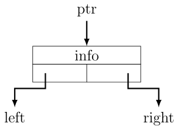
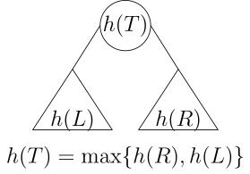
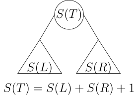
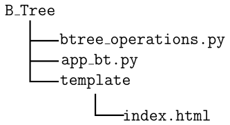



## Binary Tree Animation

### General Tree Terminology

We borrow terminology from a family tree to describe relationships between the nodes in a tree. The terminology is valid for generic tree structures. A tree consists of a collection of nodes. A node is a non-divisible unit of information (a record) in a large data structure, such as a linked list.
It may contain links (pointers) to other nodes. One node is designated as the root of the tree. The remaining nodes are classified either as <b>leaves</b> or <b>internal nodes</b>.  Formally, a tree represents a hierarchical structure defined recursively as follows:

<strong>Definition: </strong> A tree $T$ can be empty, or may consist of
- One special node $r$ called the root.
- A set of trees $k$ trees $T_1, T_2, \ldots, T_k$ (possibly empty) with roots $r_1, r_2, \ldots, r_k$ respectively.

The trees $T_1, T_2, \ldots, T_k$ are called subtrees of $T$. The roots $r_1, r_2, \ldots, r_k$ of subtrees are called children of $r$, and the node $r$ contains pointers to reach each of its children. The nodes in a tree $T$ are, thus, accessible through its root $r$. 

To explore a tree, we always start from the root. Starting from the root, we can reach a leaf node by selecting a child pointer at each internal node on the way. The sequence of nodes from the root to a leaf is called <b>tree path</b>. No tree path can extend beyond a leaf, since the node has null pointers for its children. Any non-empty subsequence of a sequence of a tree path defines a subpath that is also a tree path. There is a similarity between a linked list and a tree path. A linked list cannot extend beyond its last node that has a null pointer for its next field. Similarly, a tree path cannot extend beyond a leaf that contains no child pointer. Every pair of nodes on a tree path is related by an <b>ancestor-descendant</b> relationship. The node closer to the root is an ancestor of the node farther from the root; the latter is called a descendant of the former node. The nodes that do not share the same tree path from a root to a leaf are unrelated by the ancestor-descendant relation. The nodes with the same parent are called <b>siblings</b>. The node where a subtree begins is called the root of the subtree. We will return to elaborate on the terminology later in our text.

### Binary Tree

A Binary Tree is a restricted class of trees for which $k$ is at most 2. An internal node in a binary tree has at least one child and at most 2 children, while a leaf node has no children. The two subtrees of the root in a Binary Tree are known as the left and right subtrees. A link to the left child of a node is called the <b>left branch</b>, and the link to a right child is called the <b>right branch</b>. If a binary tree is left-skewed or right-skewed, it resembles a linear list. Similarly, if the left or right child links of the internal nodes are absent, the binary tree resembles a linked list. The configurations of a binary tree representing a linked list are shown in the figure below. The reader may notice that any  tree where each internal node has one child resembles a linked list.

 
| Config I | Config II | Config III |
|:----------:|:-----------:|:------------:|
|  |  |   |

### Node Structure, Height, and Size 

 A most basic description of a node in a binary tree with left and right child links is provided in the image below.

 
| Structure of a node |
|:----------:|
|  |

<button onclick="prev()">⬅️ Previous</button>
<button onclick="next()">Next ➡️</button>

The height and size of a binary tree play a crucial role in analyzing the time complexity of algorithms. The figures below explain these elements. The definitions are extendable to a generic tree structure in a natural way, considering the $k$ children or $k$ subtrees of a node. 

 
| T(h) = max(L(h), R(h)) + 1| Size = Size(L) + Size(R) + 1 |
|:----------:|:-----------:|
|  |  |

The figure shows that we compute the height of a binary tree as the maximum of the heights of its left and right subtrees, plus 1 for the root node. The size of a binary tree is equal to the number of nodes in it. So, we can compute the size by finding the sizes of its left and right subtrees, summing both size and adding 1 to it. 

### Traversals of a Binary Tree

How do we process data represented as a binary tree? We will consider each node that only stores one unit of data. However, in practice, it will depend on the nature of the requirements for solving a problem at hand. The fundamental operation involved in processing a binary tree data structure is a traversal. The traversal is essentially a <b>walk</b> around the branches of a Binary Tree starting from the root. The figure below illustrates a walk around a binary tree.

 
| Walk around a binary tree |
|:----------:|
|  

So, a traversal is a process of:
- Systematically visiting each node three times,
- Processing the data represented by the visited node

Depending on the instance of the visit during traversal, we distinguish three traversal mechanisms.
- <b>Preorder</b> that lists the nodes in the order they are visited for the first time. For the example shown above, the preorder list is: 1, 2, 3, 5, 8, 9, 6, 10.
- <b>Inorder</b> that lists the nodes in the order they are visited for the second time. For the example shown above, the inorder list is: 2, 1, 8, 5, 9, 3, 6, 10
- <b>Postorder</b> that lists the nodes in the order they are visited for the last time. For the example shown above, the postorder list is: 2, 8, 9, 5, 10, 6, 3, 1

An alternative way to define traversals is to do so recursively, using a tree's hierarchical relationship with its subtrees. Suppose $r$ denotes the root (of a subtree), $L$, and $R$ its left and right subtrees, respectively. Then the order of visiting the nodes in different traversals is specified recursively as follows:
- <b>Preorder</b>: $r\ L\ R$
- <b>Preorder</b>: $L\ r\ R$
- <b>Preorder</b>: $L\ R\ r$

 ### Implementation 

Implementing operations of a Binary Tree is much simpler than those of a linked list. The idea implementation here is limited to the traversals. The mutating operations, such as insertion, deletion, or search operations important. But it will not be possible to implement these operations unless we impose a partial ordering on the elements of the left and right subtrees. Binary Search Trees (BSTs), which we plan to present next, impose an ordering on nodes based on whether they belong to the left or right subtrees of a given node.  

The implementation of a Binary Tree here is based on a random decision to add a new node as a left or right child of an existing node. The implementation consists of the following:
- Binary tree class: Controls binary tree operations.
- Flassk app backend: Driver code for frontend.

The main backend class consists of:
- Generating a random list of elements
- Inserting these elements starting with an empty binary tree
- Generating traversal list when required.

Generating a random list fairly straightforward. We use the random sample to create MAX_NODES number of elements, choosing from 1 to 100. The list is then used by the function <tt>random_insert()</tt> to insert elements one at a time. This function is the heart of the random creation of a binary tree.

Initially, the root $r$ is created from the first incoming number, and a double-ended queue (dequeue) is initialized by pushing $r$ to it. It allows the function to progress the creation of a binary tree in level order. The rest of the logic is explained below.
- Dequeue the leftmost value from the dequeue, call it $n$.
- Call <tt>random.chice()</tt> to start random phase of insertion.
- If $n$ does not have a left child, the new node is inserted there. This insertion have 50% success rate.  
- If $n$ does not have a right child, the new node is inserted there. This insertion have 50% success rate.
- If random insertion fails, then  find the first available left or right child slot in level order to force an insertion.  

Since the existing nodes in the tree are deleted from the queue, the level order traversal is guaranteed both in the random phase and the forced insertion step.

The other prominent operations in the backend are traversals. Traversal algorithms are designed recursively, as described above. The implementation is through a controlling function that invokes a helper function. The helper function handles the recursion step.

### Frontend for Animation 

The animation is handled by embedded JavaScript in the <tt>index.html</tt> file. The animation's folder structure is shown in the image below.

 
| Folder structure |
|:----------:|
|  

It is possible to separate JavaScript from HTML by creating a folder <tt>static</tt> and placing the script file there. The HTML file specifies:
- CSS styles
- Control Buttons

The number of nodes can be controlled by a backend variable <tt>MAX_NODES</tt> in <tt>btree_operations.py</tt>. Since the generation of the binary tree is random, which returns a list of nodes, the frontend animates the display in the visual area of the canvas.   

The front has several functions:

